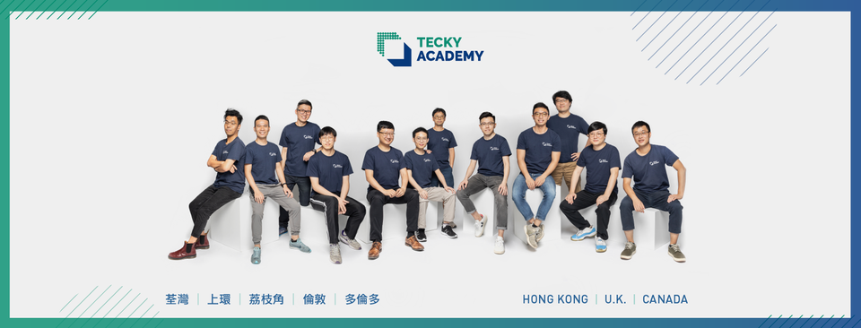

## Hi! We are Tecky Academy Team

We are a coding bootcamp founded in 2018 Hong Kong.
We strive to educate newcomers to understand the computer science fundamentals and pragmatic programming language for them to thrive in the tech industry.

We are also a strong advocate of **open source** technology with most of the technologies, frameworks and libraries we taught in the curriculum being **FOSS**.

If you are a software engineer and you are looking 
for a workplace that actually cares about software development,

Please join us! We are actively hiring! 
